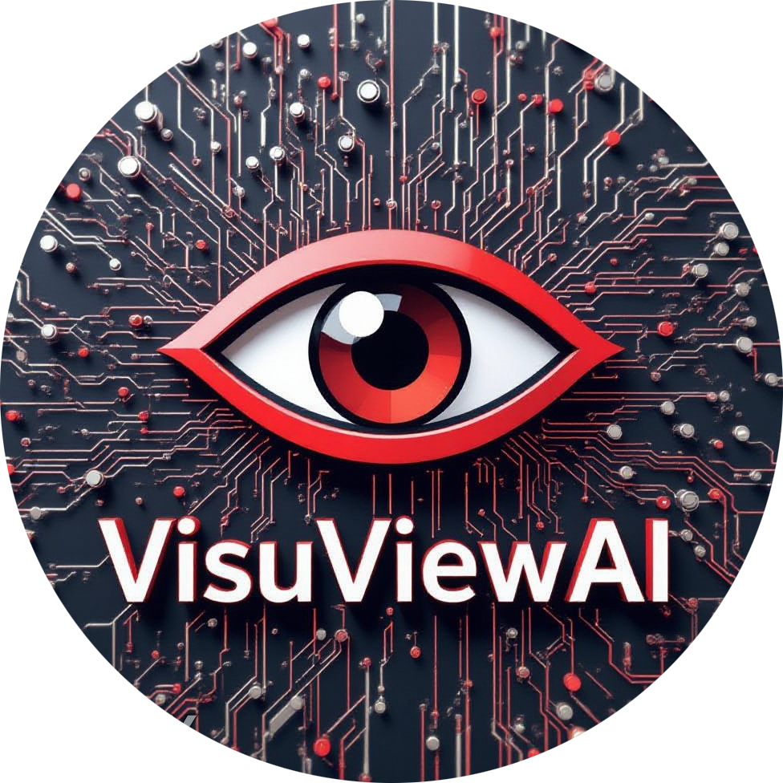
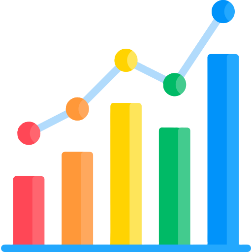
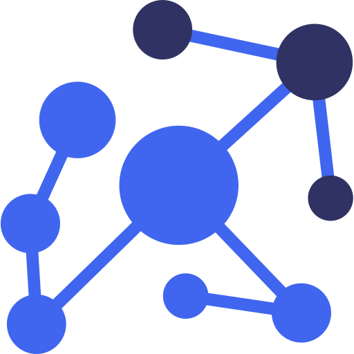

<h1 align="center">Hi 👋, I'm Nisha Mallick</h1>

 

 

<h3 align="center">A passionate Bsc IT student with an innovative mind, driven to build impactful and creative solutions - on a mission to make a lasting impact in the tech world.</h3>

 
- 🔭 I’m currently working on : [ViscaraiAssist.com] ( https://github.com/Nisha-Mallick/ViscaraiAssist )

- 🌱 Current Interests: **Artificial Intelligence • Cloud Technologies • Software Engineering • Full-Stack Development • Building Real-World Products**

- 📫 How to reach me : **nishamallici821@gmail.com**

- 📄 Know about my experiences : [https://drive.google.com/file/d/15Vl-TEAJ-DZniHIuSZGt3ol2qXNiLscl/view?usp=sharing](https://drive.google.com/file/d/15Vl-TEAJ-DZniHIuSZGt3ol2qXNiLscl/view?usp=sharing)
 

<h3 align="left"> 
&nbsp;Technical Skills and Languages:
</h3>
 

 
    
  
     
  

<h3 align="left"> 
&nbsp;Featured Projects:
</h3>

<table>
<tr>
<td width="50%" valign="top" align="center">

<h3>VisuView AI</h3>

Computer Vision application that compares images using OpenCV and generates intelligent AI-powered visual difference summaries.

</td>
</tr>

<tr>
 <td width="50%" valign="top" align="center">

<h3>ViscaraiAssist</h3>

AI-powered Interview Preparation Platform featuring mock interviews, ATS resume analysis, AI feedback and personalized career guidance.

</td>
</tr>

<tr>
 <td width="50%" valign="top" align="center">

<h3>Tragency AI</h3>

AI-powered travel planning platform that creates personalized itineraries using modern web technologies and intelligent recommendations.

</td>
</tr>

<tr>
 <td width="50%" valign="top" align="center">

<h3>CinCrafit AI</h3>

AI-powered movie deals assistant that verifies offers using RAG, Groq LLM, Firebase Authentication and intelligent coupon validation.

</td>
</tr>

</table>

   
<!-- Profile Views Badge -->

  

<!-- GitHub analytics streak-->
<h3 align="left">

&nbsp;GitHub Analytics:
</h3>

<h3 align="left"> 
&nbsp;Contribution Activity:
</h3>

  
<h3 align="left"> 
&nbsp;Connect with me:
</h3>

&nbsp;&nbsp;
&nbsp;&nbsp;
&nbsp;&nbsp;
&nbsp;&nbsp;

